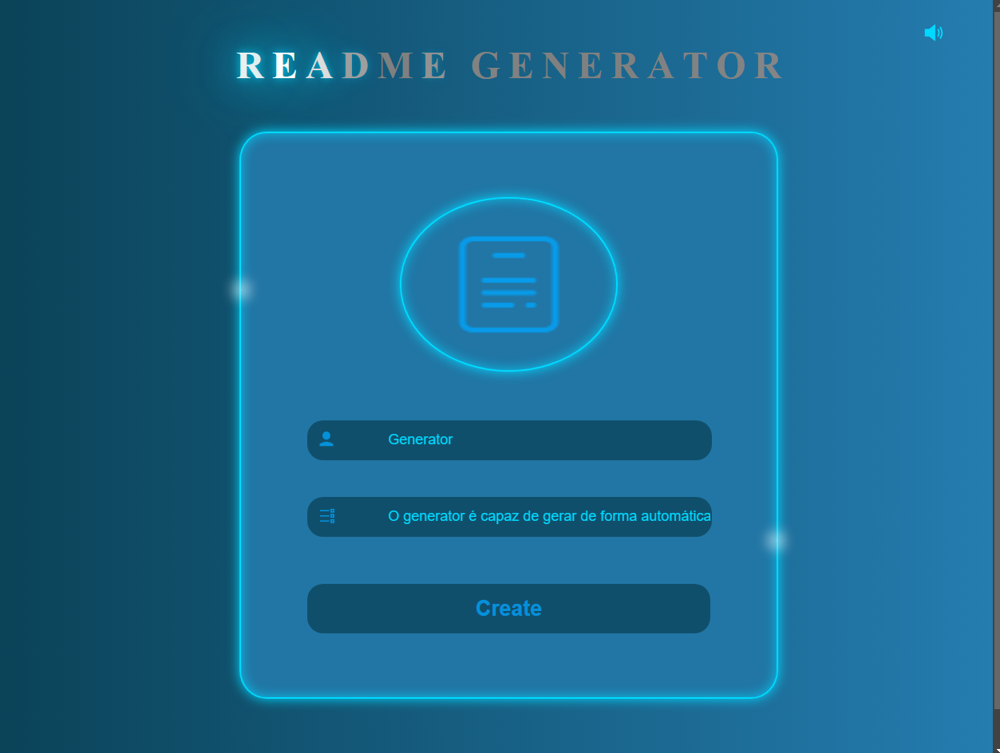

Click here to change the language:

 

# Readme Generator

O projeto Readme Generator é uma aplicação web desenvolvida para automatizar a criação de arquivos README padronizados e estilizados para projetos de software. Com foco na produtividade e padronização, a ferramenta facilita a geração de documentações completas, garantindo que cada projeto possua uma descrição clara, organizada e atrativa.  A aplicação foi construída utilizando a biblioteca React, proporcionando uma interface moderna e intuitiva, que permite ao usuário criar e personalizar seus README files com facilidade. Além disso, o projeto faz uso de styled-components, permitindo a criação de estilos customizados diretamente nos componentes React, garantindo consistência visual em cada README gerado.  Entre as funcionalidades principais estão a possibilidade de definir seções específicas como descrição do projeto, tecnologias utilizadas, instruções de instalação, uso, e muito mais. O Readme Generator também inclui ícones estilizados, graças à integração com a biblioteca react-icons, oferecendo um toque visual diferenciado aos arquivos README. O Readme Generator não só simplifica o processo de documentação para os desenvolvedores, como também promove uma padronização essencial para a organização de projetos de software.

:computer: [Click here to access the application](http://localhost:5173/)

## Technologies

## Secondary Technologies

## Dependencies

- react
- react-dom
- styled-components
- react-icons
- vite
- typeScript
- ESLint

## Getting Started

This project can be used on your own machine after performing a PUSH of this repository.

### `npm install`

To download and update all project libraries and dependencies

### `npm start`

Runs the application in development mode.
Open [http://localhost:5173/](http://localhost:5173/) to view it in your browser, or another port that the project is using.

The page will reload when you make changes.
You may also see any lint errors in the console.

## Contact

  
   
  
   

    